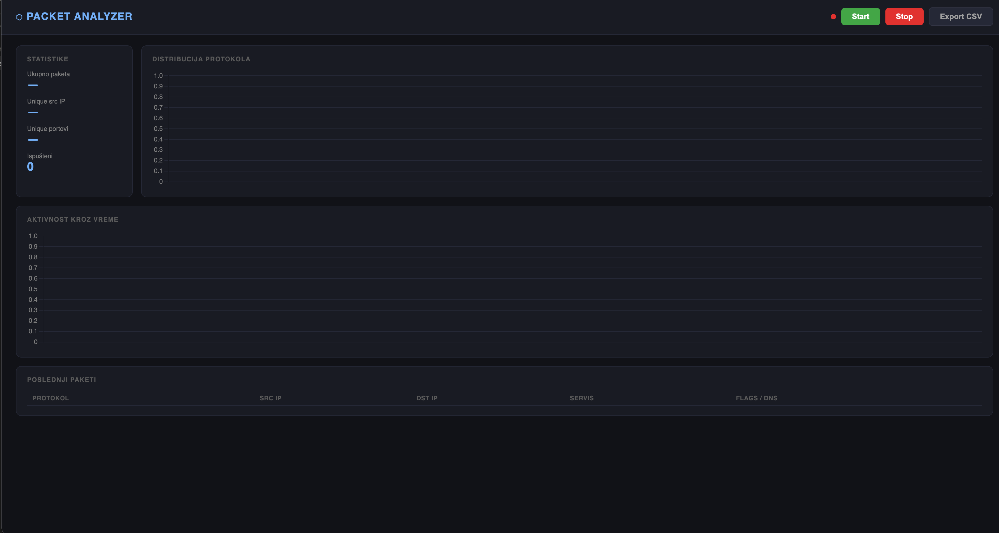
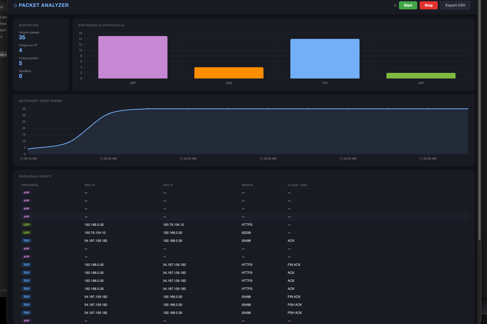
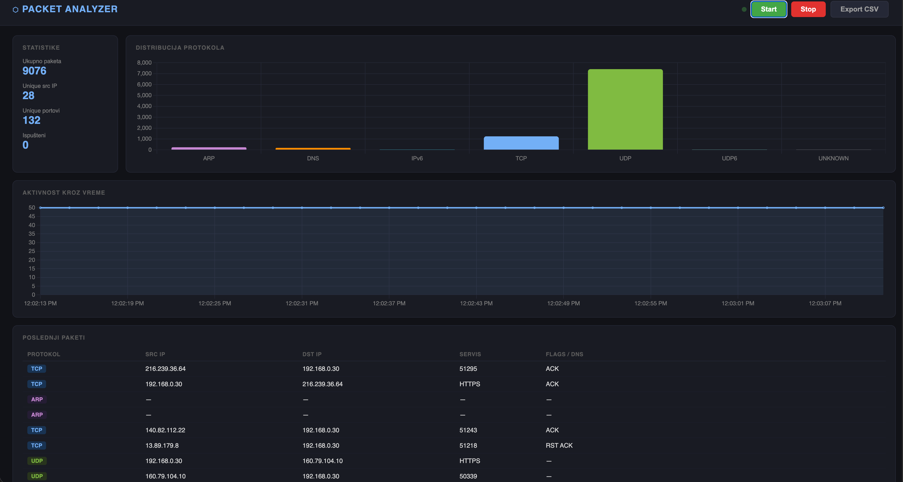

# Packet Analyzer

A real-time network packet analyzer built with Python. Captures live traffic from a network interface, decodes protocol layers, and displays statistics in a web dashboard.

---

## Screenshots

### Dashboard — initial state


### Active capture


### Heavy traffic


---

## Features

- **Live packet capture** using Scapy with threading and a queue buffer
- **Protocol parsing** — Ethernet, IPv4, IPv6, TCP, UDP, DNS, ARP
- **Real-time dashboard** that updates every 2 seconds
- **Protocol distribution chart** with color-coded bars
- **Activity timeline** showing packets per second
- **Port scan detection** — flags IPs contacting too many ports
- **CSV export** of captured packet data
- **Start / Stop** capture control with frozen display on stop

---

## Tech Stack

| Layer | Technology |
|---|---|
| Capture | Scapy, threading, queue |
| Parsing | Scapy protocol layers |
| Analysis | pandas |
| Visualization | matplotlib (export), Chart.js (web) |
| Web backend | Flask |
| Web frontend | HTML, CSS, JavaScript |

---

## Project Structure

```
packet-analyzer/
├── capture/
│   └── sniffer.py       # PacketSniffer class
├── analysis/
│   ├── parser.py        # Protocol parser
│   └── analyzer.py      # Statistics and port scan detection
├── web/
│   ├── app.py           # Flask application
│   └── templates/
│       └── index.html   # Dashboard
├── tests/
│   ├── test_sniffer.py
│   ├── test_parser.py
│   └── test_analyzer.py
├── exports/             # CSV output (auto-created)
├── docs/screenshots/
└── requirements.txt
```

---

## Installation

**Requirements:** Python 3.11+, macOS or Linux

```bash
# 1. Clone the repository
git clone https://github.com/uros-cvetkovski/packet-analyzer.git
cd packet-analyzer

# 2. Create virtual environment
python3.11 -m venv venv

# 3. Activate virtual environment
source venv/bin/activate

# 4. Install dependencies
pip install -r requirements.txt
```

---

## Usage

### Starting the dashboard

Packet capture requires **root privileges** to access the network interface.

> **Important — sudo and virtualenv:**
> `sudo` resets your `PATH`, so `sudo python` will use the system Python
> and won't find the packages installed in your virtualenv.
> Always pass the full path to the virtualenv's Python binary:

```bash
# Run from the project root directory
sudo venv/bin/python web/app.py
```

Open **http://127.0.0.1:8080** in your browser, then click **Start** to begin capture.

### Stopping the server

Press `Ctrl + C` in the terminal where the server is running.

### Exporting CSV

1. Start a capture session and let it run for a few seconds.
2. Click **Export CSV** in the dashboard header.
3. The file `packets.csv` will be downloaded automatically.

> **Note:** The export button returns an error if no packets have been captured yet.
> Start the capture first, then export.

---

## Running tests

```bash
# Activate virtualenv first (no sudo needed for tests)
source venv/bin/activate

# Run all tests
python -m pytest tests/ -v

# Run a single test file
python -m pytest tests/test_parser.py -v
```

---

## Protocols Supported

| Protocol | Info extracted |
|---|---|
| Ethernet | src/dst MAC, frame type |
| IPv4 | src/dst IP, TTL |
| IPv6 | src/dst IP, hop limit |
| TCP | ports, flags (SYN/ACK/FIN...), service name |
| UDP | ports, length, service name |
| DNS | query domain, response type |
| ARP | request/reply, src/dst IP and MAC |

---

## Troubleshooting

### `ModuleNotFoundError: No module named 'flask'` (or scapy, pandas…)

You ran `sudo python web/app.py` without specifying the virtualenv binary.
Use `sudo venv/bin/python web/app.py` instead — this explicitly invokes the virtualenv's Python,
which has all the installed packages.

### `Permission denied` / `Operation not permitted` during capture

Packet capture requires root. Make sure you are using `sudo`:

```bash
sudo venv/bin/python web/app.py
```

### CSV download returns an error

The export requires at least one captured packet. Click **Start**, wait a few seconds for
traffic to appear in the table, then click **Export CSV**.

### `Address already in use` on port 8080

Another process is using the port. Find and stop it:

```bash
lsof -i :8080
kill -9 <PID>
```

### No packets appear after clicking Start

Check that your network interface is active. By default Scapy auto-detects the default interface.
If capture still shows nothing, verify you have network activity (e.g. open a website in the browser).

---

## Author

**Uroš Cvetkovski** — [github.com/uros-cvetkovski](https://github.com/uros-cvetkovski)
